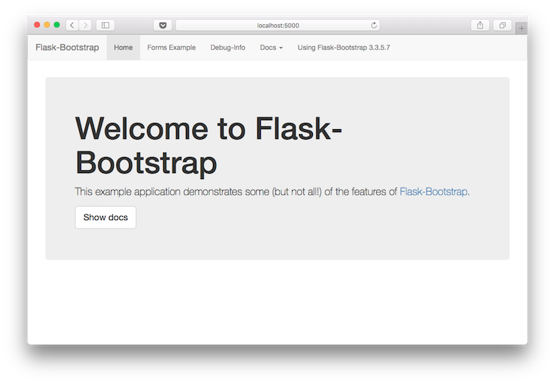

## Flask-bootstrap
### Sample App 

- Create a VirtualEnv

- follow steps given in the sample_app/init.py file
  - `pip install` required packages from requirements.txt
  - from the sample_app parent folder, run the following command:
     `$ flask --app=sample_app dev`

  - App on local at http://localhost:5000/

### Screenshot 

